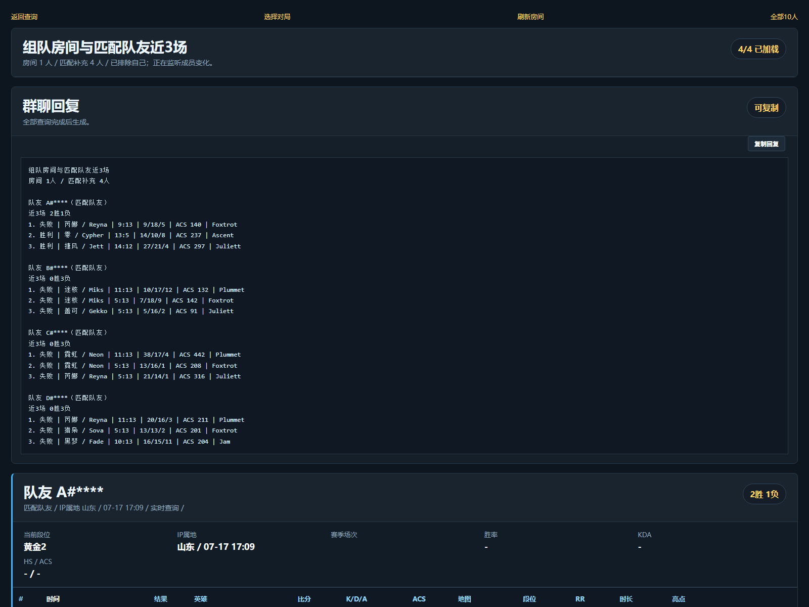
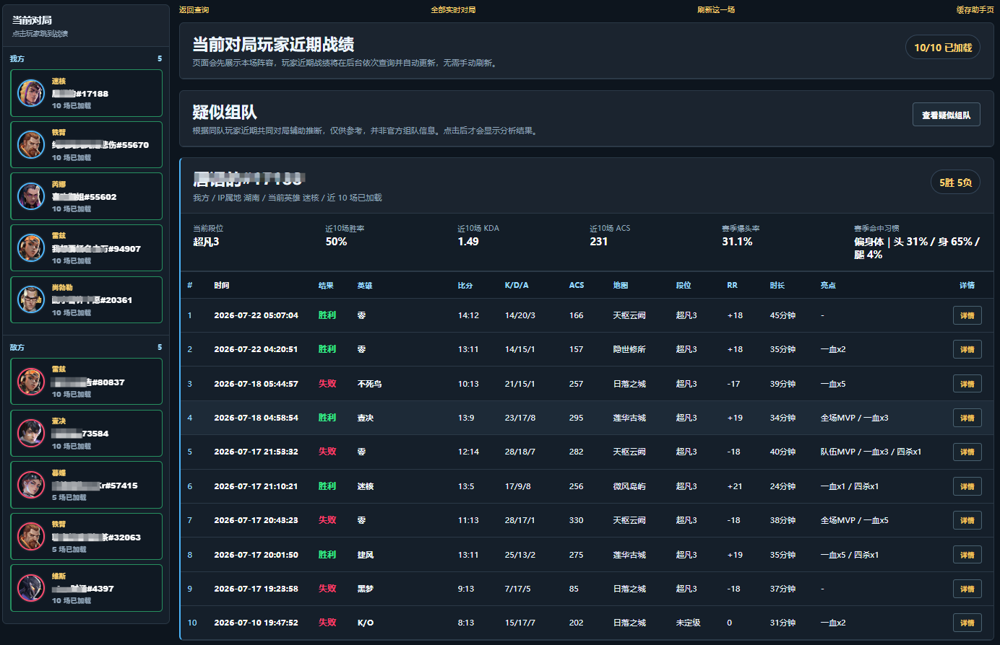
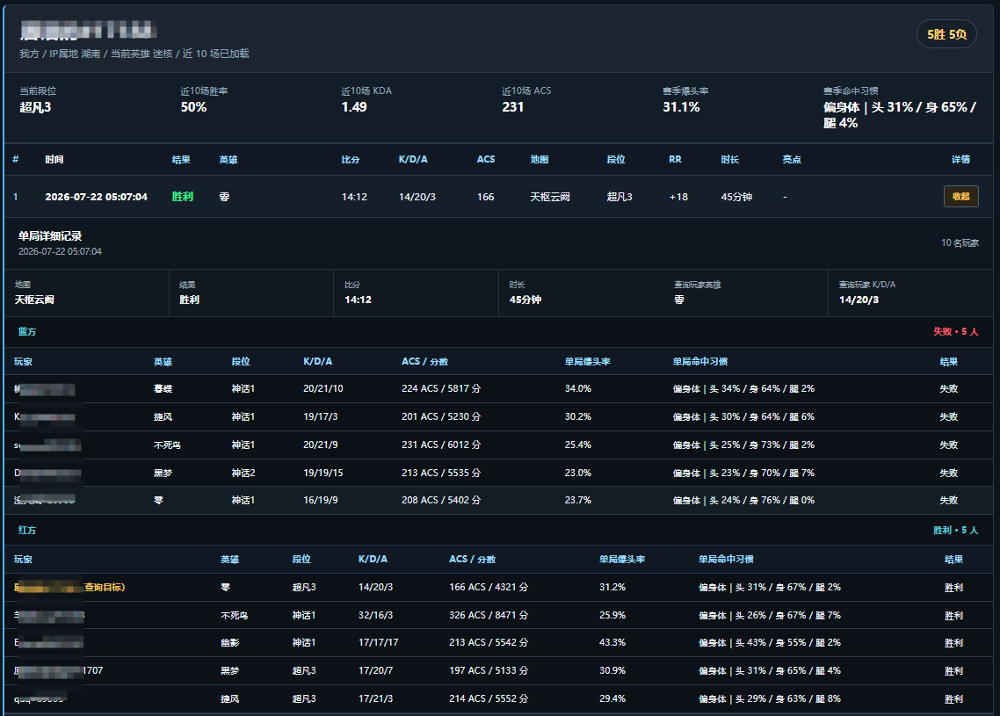
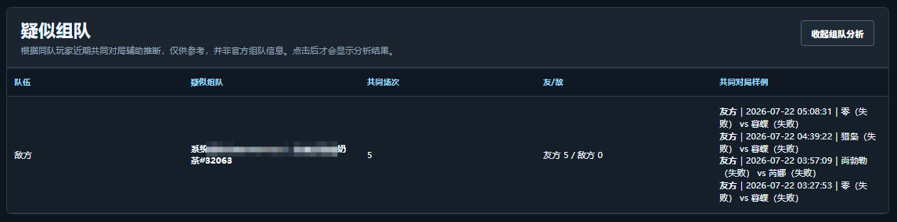
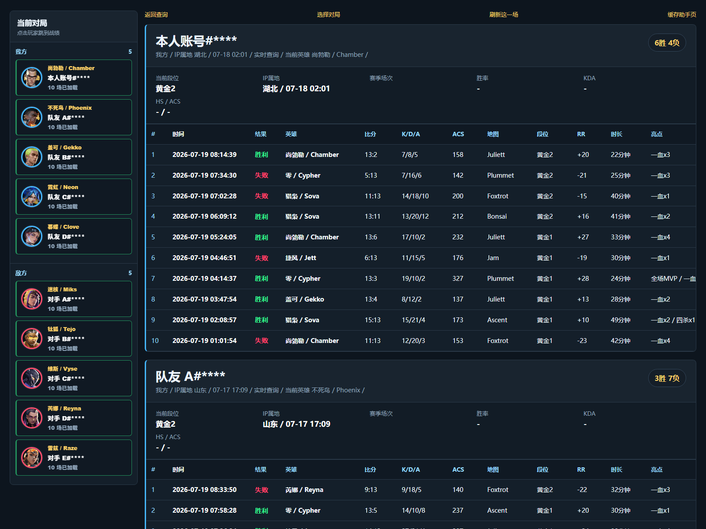
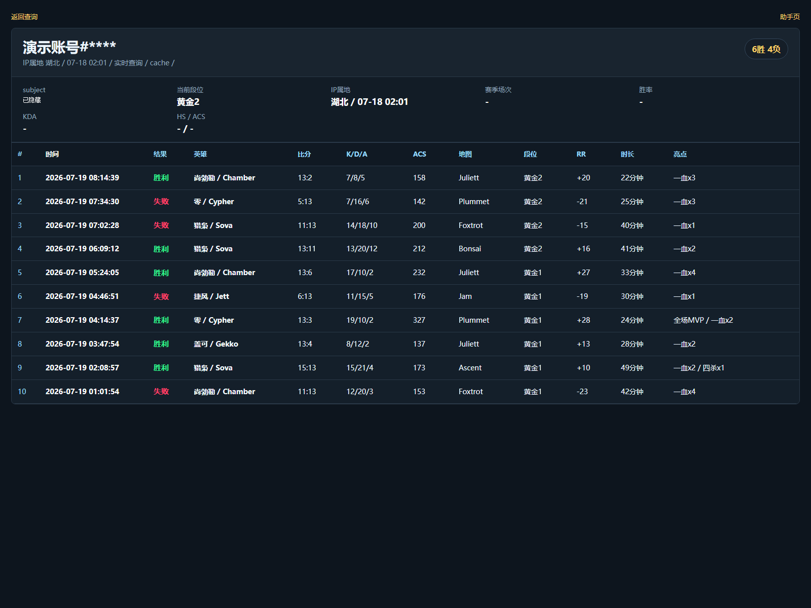
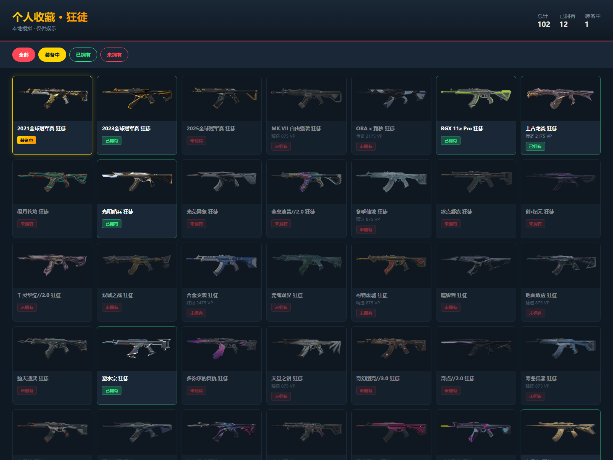
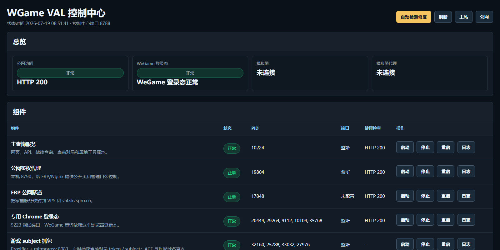
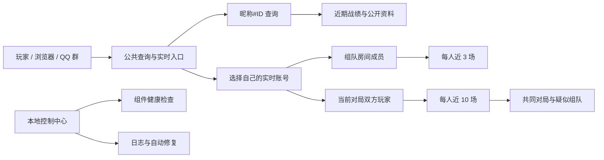

<div align="center">

# 无畏契约战绩查询 · WGame VAL Query

**面向国服《无畏契约》的战绩查询、开局前房间分析与当前对局助手**

昵称#ID 直查近期状态 · 房间成员近 3 场 · 当前对局 10 人战绩 · 赛季/单局爆头率与命中分布

<p>
  <a href="https://val.skzspro.cn/public">
    
  </a>
  <a href="https://val.skzspro.cn/live">
    
  </a>
  <a href="docs/USAGE.md">
    
  </a>
</p>

<p>
  
  
  
</p>

[效果预览](#效果预览) · [功能总览](#功能总览) · [快速开始](#快速开始) · [更新日志](docs/CHANGELOG.md) · [项目文档](#项目文档)

</div>

> [!IMPORTANT]
> 这是项目的公开展示仓库，提供产品介绍、使用教程、真实截图、更新记录和反馈入口。核心服务端、登录态处理、抓包链路和生产部署配置暂不公开，普通用户直接使用在线站点即可。

> [!NOTE]
> 本项目是非官方社区工具，与 Riot Games、腾讯、WeGame 无从属或合作关系。疑似组队等分析结果只作参考，不代表官方 Party 信息。

## 一眼看懂

很多时候，玩家真正需要的不是一张复杂的数据报表，而是在有限时间里快速回答几个问题：

| 阶段 | 想知道什么 | WGame VAL Query 提供什么 |
| --- | --- | --- |
| 找人组队时 | 新进房间的玩家近期状态怎么样 | 房间成员近 3 场，成员加入或退出后自动同步 |
| 匹配完成后 | 系统补入的其他队友是否稳定 | 自动补齐不在原房间中的同阵营玩家 |
| 选人和加载阶段 | 双方英雄、段位和近期表现如何 | 当前对局 10 人战绩异步加载 |
| 复盘具体一局时 | 双方 10 人数据和枪法分布如何 | 展开单局详情，查看 K/D/A、ACS、爆头率和头/身/腿命中分布 |
| 判断开黑关系时 | 哪些玩家可能一起排位 | 共同对局推断、彩色头像外圈和连接线 |
| 只想查一个人时 | 最近输赢、KDA、ACS 和 RR 如何 | 输入 `昵称#ID` 直接查询近 10 场 |

一句话概括：

> **开局前看队友，匹配后看完整阵容，对局中快速了解双方近期状态。**

## 效果预览

### 开局前：房间成员与匹配队友近 3 场

玩家进入或退出房间时，页面会自动重建列表；匹配组成完整队伍后，还会补入原 Party 之外的其他我方玩家。

<a href="assets/screenshots/room-teammates-long.png">
  
</a>

### 当前对局：双方 10 人战绩与疑似组队

左侧按我方和敌方展示当前英雄，右侧逐个加载每名玩家近 10 场战绩、赛季爆头率和命中习惯。疑似组队分析默认收起，由用户主动查看。

<a href="assets/screenshots/current-match-real.png">
  
</a>

### 展开单局：双方 10 人数据与命中分布

每条近期战绩都可以在当前页面展开详情。双方 10 名玩家会按阵营列出英雄、段位、K/D/A、ACS/分数、单局爆头率，以及头、身体、腿部的实际命中占比。

<a href="assets/screenshots/battle-hit-distribution.png">
  
</a>

### 主动查看疑似组队分析

分析面板默认折叠。展开后可以看到疑似小队、近期共同场次、当时的友方/敌方关系和共同对局样例；它来自历史数据辅助推断，并非官方组队信息。

<a href="assets/screenshots/party-analysis.png">
  
</a>

## 功能总览

### 1. 昵称直查近期战绩

打开[公共查询页](https://val.skzspro.cn/public)，输入：

```text
游戏昵称#数字ID
```

例如：

```text
GGbone#55989
```

即可查看：

- 最近 10 场胜负与比分
- 使用英雄及中英文名称
- K/D/A、ACS、地图和对局时长
- 当局段位与 RR 变化
- 一血、多杀、MVP 等高光信息
- 当前赛季爆头率与头/身/腿命中习惯
- 点击“详情”在原页面展开双方 10 人数据
- 数据接口返回的公开省级 IP 属地

### 2. 开局前房间成员近 3 场

进入组队房间后，实时页面会持续识别成员变化：

- 自动排除当前账号
- 每名队友加载近 3 场核心数据
- 玩家加入或退出时自动刷新
- 区分“房间成员”和“匹配队友”
- 匹配完成后补齐其他我方玩家
- 生成可直接复制到群聊的文本摘要

这部分不要求已经进入正式对局，适合找人组队、五排房间和开黑前快速了解队友。

### 3. 当前对局 10 人助手

检测到选人或正式对局后，页面会：

- 按我方 / 敌方排列双方玩家
- 显示当前英雄头像
- 用蓝色 / 红色内圈保留阵营识别
- 异步加载每名玩家近 10 场战绩
- 点击左侧玩家直接跳到对应数据
- 展示段位、KDA、ACS、地图与近期胜负
- 展示赛季爆头率与头/身/腿命中分布
- 支持展开每场比赛的 10 人单局详情
- 对共同对局关系进行辅助分析

### 4. 疑似组队彩色连线

系统会比较同阵营玩家近 10 场中的共同对局：

- 曾作为友方共同参赛的玩家会形成关系
- 相互关联的多人自动合并成一个疑似小队
- 分析默认折叠，只有主动点击后才展示
- 展示共同场次、友方/敌方关系和共同对局样例
- 每个小队使用不同颜色
- 头像外圈、短分支、纵向连线和“组队 N”标签同步显示

这不是官方 PartyID，只是根据近期共同对局生成的辅助判断。

### 5. 单局详情与命中习惯

点击近期战绩右侧的“详情”，无需离开当前页面即可查看：

- 蓝方和红方完整 10 人数据
- 英雄、段位、K/D/A、ACS 与分数
- 单局爆头率
- 头、身体、腿部命中占比与主要命中习惯

爆头率按“头部命中数 ÷ 头、身体、腿部总命中数”计算，来自该局实际命中数据，不使用爆头击杀数推测。赛季命中习惯和单局命中习惯会分开显示，避免用一场比赛替代长期表现。

### 6. 其他扩展能力

| 功能 | 说明 | 状态 |
| --- | --- | --- |
| QQ 群战绩摘要 | 输入昵称，返回近 5 场纯文本战绩 | 已接入项目链路 |
| 武器藏品 | 集中查看账号武器外观和图片 | 已完成 |
| 公开 IP 属地 | 只显示公开省级属地，不显示真实 IP | 已完成 |
| 运维控制中心 | 组件状态、日志、启停、重启和自动修复 | 已完成 |
| WeGame 登录态保活 | 独立 `9223` Chrome 定时刷新登录态 | 已完成 |

## 快速开始

### 方式 A：只查询某个玩家

不需要安装程序，也不需要连接游戏。

1. 打开[公共战绩查询](https://val.skzspro.cn/public)。
2. 输入完整的 `昵称#ID`。
3. 点击查询，等待近期战绩加载。

### 方式 B：查看与自己有关的实时房间和对局

1. 打开[实时对局入口](https://val.skzspro.cn/live)。
2. 阅读封号与网络流量处理风险，逐项勾选并确认[风险知情与使用协议](DISCLAIMER.md)。
3. 按页面给出的步骤完成连接和验证。
4. 页面列出当前网络下仍有效的游戏账号后，按昵称选择自己的账号。
5. 组队阶段进入“房间近 3 场”。
6. 匹配完成后进入“当前对局 10 人”。
7. 使用结束后，按页面的恢复步骤还原网络设置。

网吧内多人可能共享同一个公网 IP，所以 IP 只用于缩小候选范围。系统不会自动把同 IP 下最新上传的对局认定为你的对局，必须由用户按昵称选择。

更完整的操作步骤、页面状态说明和故障排查见：

> **[使用教程：从昵称查询到实时对局](docs/USAGE.md)**

## 页面画廊

所有截图均来自实际运行页面或脱敏演示数据，真实昵称、标签和内部查询标识已隐藏。

<table>
  <tr>
    <td width="50%" valign="top">
      <a href="assets/screenshots/player-record.png">
        
      </a>
      <br>
      <strong>单个玩家近期战绩</strong>
      <br>
      近 10 场、英雄、KDA、ACS、地图、段位和 RR。
    </td>
    <td width="50%" valign="top">
      <a href="assets/screenshots/query-real.png">
        
      </a>
      <br>
      <strong>昵称#ID 查询结果</strong>
      <br>
      面向普通用户的公共查询结果页。
    </td>
  </tr>
  <tr>
    <td width="50%" valign="top">
      <a href="assets/screenshots/collection-real.png">
        
      </a>
      <br>
      <strong>武器藏品</strong>
      <br>
      集中查看账号拥有的武器外观。
    </td>
    <td width="50%" valign="top">
      <a href="assets/screenshots/control-center-real.png">
        
      </a>
      <br>
      <strong>运维控制中心</strong>
      <br>
      服务健康状态、日志、组件控制和自动修复。
    </td>
  </tr>
</table>

<details>
<summary><strong>查看更多页面截图</strong></summary>

<br>

- [完整房间成员长图（1600 × 3200）](assets/screenshots/room-teammates-long.png)
- [当前对局疑似组队关系](assets/screenshots/party-insight.png)
- [单局详情](assets/screenshots/battle-detail.png)
- [QQ 群文本回复](assets/screenshots/qq-summary.png)
- [完整截图清单](docs/SCREENSHOTS.md)

</details>

## 工作原理



实时链路的核心原则是：

1. 先识别与当前网络有关的有效账号。
2. 再由用户按游戏昵称选择自己的账号。
3. 房间和当前对局页面只读取这个明确选择。
4. 对外响应移除内部 session、subject、PartyID、原始事件 ID 和 token 来源。

## 隐私与安全边界

- 不展示玩家真实 IP。
- 只展示数据接口返回的公开省级 IP 属地。
- 同网络筛选只用于寻找候选账号，不能代替用户选择。
- 未选择账号时，不自动加载任何实时对局。
- 公共页面不会返回内部会话标识、原始玩家标识或登录凭据。
- 内部会话列表、token 推送、快照保存和管理接口继续受保护。
- 实时功能会处理相关网络流量，可能存在账号限制或封禁风险；有限测试中暂未发现封号不代表零风险。
- 用户必须阅读并逐项确认版本化风险协议，服务端验证通过后才开放实时连接与查询链路。
- 公共查询会记录访问 IP、查询内容、关联账号和处理结果；实时功能会记录访问 IP、会话来源 IP、用户选择的账号、入口和处理结果。使用记录默认保留 180 天。
- 原始 IP 只在本机管理数据中使用，不会出现在公共战绩或实时对局结果页。
- Issue 中请勿提交 Cookie、token、抓包文件、登录二维码或私人聊天内容。

完整说明见[风险知情与使用协议](DISCLAIMER.md)、[隐私说明](docs/PRIVACY.md)和[常见问题](docs/FAQ.md)。

## 项目状态

| 模块 | 当前状态 |
| --- | --- |
| 公共昵称查询 | 可用 |
| 房间成员近 3 场 | 可用 |
| 匹配补入队友 | 可用 |
| 当前对局 10 人 | 可用 |
| 行内单局 10 人详情 | 可用 |
| 赛季/单局爆头率与命中分布 | 可用 |
| 疑似组队彩色连线 | 可用 |
| QQ 群文本摘要 | 项目链路已支持，公开接入方式整理中 |
| 核心服务端源码 | 暂不公开 |

## 项目文档

| 文档 | 内容 |
| --- | --- |
| [使用教程](docs/USAGE.md) | 昵称查询、实时连接、账号选择和常见故障 |
| [更新日志](docs/CHANGELOG.md) | 每次功能更新与行为变化 |
| [FAQ](docs/FAQ.md) | 部署、隐私、房间成员和疑似组队说明 |
| [Roadmap](docs/ROADMAP.md) | 已完成功能与后续计划 |
| [隐私说明](docs/PRIVACY.md) | 数据记录范围、保存期限、用户权利和敏感信息边界 |
| [截图清单](docs/SCREENSHOTS.md) | 公开截图用途和内容说明 |

## 反馈与贡献

欢迎通过 [GitHub Issues](https://github.com/val0628/valorant-cn-stats-query/issues) 提交：

- 查询失败的昵称样例和发生时间
- 页面体验与移动端建议
- 希望增加的战绩字段
- 房间和当前对局功能建议
- QQ 群接入场景

提交问题时不要附带 Cookie、token、抓包文件或任何私人登录态。

## 公开范围

本仓库公开：

- 项目介绍与使用教程
- 脱敏后的产品截图
- 更新日志、FAQ 与 Roadmap
- 可公开的轻量演示页面

本仓库不公开：

- 核心服务端代码
- 登录态和 token 处理
- 抓包链路与生产配置
- 本地数据、缓存和日志

## Star

如果这个项目对你有帮助，欢迎点一个 Star。

Star 会让更多搜索“无畏契约战绩查询”“瓦战绩查询”“Valorant 国服战绩查询”的玩家找到这个入口，也会推动房间分析、当前对局助手和 QQ 群查询继续完善。

<div align="center">

**[打开公共查询](https://val.skzspro.cn/public) · [进入实时对局](https://val.skzspro.cn/live) · [风险协议](DISCLAIMER.md) · [阅读使用教程](docs/USAGE.md)**

</div>
