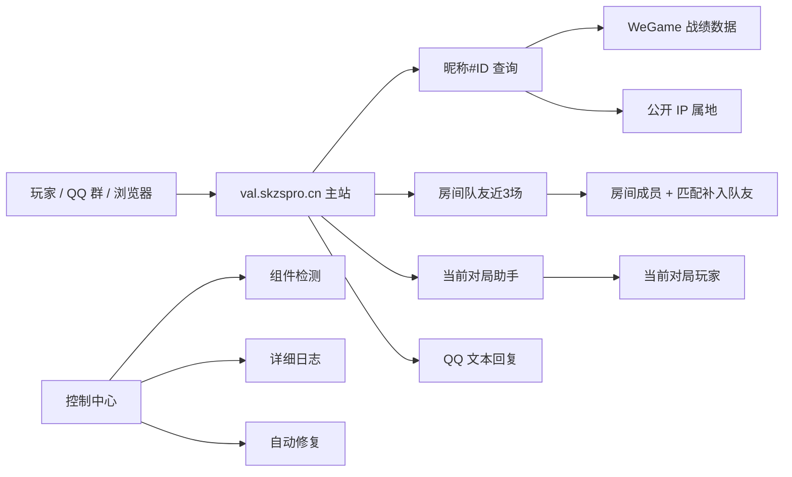

# 无畏契约战绩查询 | WGame VAL Query

国服《无畏契约》在线战绩查询、开局前房间队友分析、当前对局助手与 QQ 群战绩回复工具。

> 搜索 `无畏契约战绩查询`、`瓦战绩查询`、`Valorant 国服战绩查询` 来到这里的玩家，可以直接去主站使用：
>
> **在线查询入口：[https://val.skzspro.cn/public](https://val.skzspro.cn/public)**

输入一个 `昵称#ID`，快速查看无畏契约玩家近期战绩、英雄、KDA、ACS、地图和段位变化。进入组队房间后，还能在开局前自动加载房间成员以及匹配补入队友的近 3 场战绩。

这个仓库是项目的公开展示页：用于介绍功能、收集反馈、展示截图和发布更新记录。核心服务端不在本仓库开源，欢迎直接访问主站使用。

## 在线无畏契约战绩查询

主站地址：

[https://val.skzspro.cn/public](https://val.skzspro.cn/public)

支持输入：

```text
玩家昵称#数字ID
```

例如：

```text
GGbone#55989
```

适合用来查询：

- 无畏契约近期战绩
- 国服 Valorant 战绩
- WeGame 无畏契约战绩
- 无畏契约玩家 KDA / ACS
- 无畏契约当前对局玩家状态
- QQ 群无畏契约战绩查询

## 它解决什么问题

无畏契约玩家经常需要在很短时间内判断：

- 队友最近状态怎么样。
- 组队房间里新加入的玩家最近打得怎么样。
- 匹配组成完整队伍后，其他我方玩家状态如何。
- 对手是不是某个英雄绝活。
- 某个玩家近几场是不是连败、补位、掉分。
- 当前对局里谁和谁疑似一起排。
- QQ 群里能不能直接发昵称查近 5 场。

WGame VAL Query 想做的就是把这些信息放到一个更顺手的入口里。少点页面，多看结果。

## 功能亮点

### 开局前查看房间队友近 3 场

进入组队房间后，实时页面会自动读取当前房间中的其他成员：

- 每名队友加载近 3 场胜负、比分、英雄、KDA、ACS、地图、段位与 RR
- 自动排除当前账号
- 玩家加入或退出房间时自动刷新
- 匹配成功后，自动补齐不在原房间中的其他我方玩家
- 区分“房间成员”和“匹配队友”
- 显示查询进度，并生成可以直接复制到群聊的战绩摘要

这让玩家在正式进入对局前，就能了解开黑房间和匹配队友的近期状态。

### 昵称#ID 直接查询

打开主站，输入：

```text
GGbone#55989
```

即可查看近期战绩：

- 胜负和比分
- 英雄，中英文一起展示
- K/D/A
- ACS
- 地图
- 段位和 RR 变化
- 最近几场胜率

如果你只是想查战绩，直接打开：

[https://val.skzspro.cn/public](https://val.skzspro.cn/public)

### 当前对局助手

进入对局后，可以生成当前对局页：

- 我方 / 敌方分组展示
- 左侧显示双方玩家和当前英雄头像
- 蓝色头像边框代表我方，红色头像边框代表敌方
- 每个玩家近 10 场战绩
- 异步加载，谁查完谁先出现
- 左侧玩家导航，点击直接滚到对应战绩
- 疑似组队关系
- 交叉对局中是友方还是敌方

这部分是项目最像 5EBOX 的地方，但它是围绕国服无畏契约和 WeGame 生态重新做出来的。

### 公开 IP 属地

项目可选展示数据接口返回的公开属地，例如：

```text
IP属地：贵州
```

只展示公开属地，不展示真实 IP。

### 武器藏品查看

藏品页可以集中查看账号武器外观和对应图片，作为战绩与对局助手之外的扩展功能。

### QQ 群战绩回复

QQ 插件可接入主站接口，用户发送：

```text
查瓦 GGbone#55989
```

机器人返回近 5 场纯文本战绩，适合群内快速查看。

### 运维控制中心

项目后端配套了本地控制中心，用来管理服务组件：

- 主查询服务
- 公网代理
- FRP
- 专用 Chrome 登录态
- 属地数据抓包
- 登录态推送
- 好友 subject 缓存监听

控制中心支持状态检测、启动、停止、重启、自动修复和日志查看。专用 Chrome 使用独立的 `9223` 调试端口，服务会定时刷新 WeGame 登录态；WeGame 客户端的 `9222` 仅作为备用查询通道。

## 项目架构



## 在线体验

主站：

[https://val.skzspro.cn/public](https://val.skzspro.cn/public)

建议体验方式：

1. 打开主站。
2. 输入一个国服无畏契约 `昵称#ID`。
3. 查看近期战绩。
4. 如果你是 QQ 群服主，可以关注后续 QQ 插件接入说明。

常见搜索词：

```text
无畏契约战绩查询
无畏契约近期战绩查询
瓦战绩查询
Valorant 战绩查询
国服无畏契约战绩查询
WeGame 无畏契约战绩
无畏契约当前对局助手
无畏契约 QQ 机器人战绩查询
```

## 截图

以下图片均来自实际运行页面，并已隐藏真实昵称、标签和内部查询标识。

### 开局前房间队友近 3 场


### 当前对局 10 人阵容


### 单个玩家近期战绩


### 昵称查询结果


### 武器藏品


### 控制中心


完整房间长图：[查看 1600×3200 详情图](assets/screenshots/room-teammates-long.png)。

概念演示图和 QQ 群文本回复图仍保留在 `assets/screenshots`，用于展示不同使用场景。

截图清单见：[docs/SCREENSHOTS.md](docs/SCREENSHOTS.md)

## 与 5EBOX 的关系

很多玩家都熟悉 5EBOX 那种“进局前快速看信息”的体验。

这个项目的目标不是复制某个产品，而是把国服无畏契约玩家真正想看的东西重新组合起来：

- 更贴合 WeGame 国服环境
- 支持昵称#ID 查询
- 支持开局前房间队友近 3 场
- 匹配成功后自动补齐其他我方玩家
- 支持 QQ 群文本战绩
- 支持当前对局页
- 后端有控制中心，方便长期维护

它是一次从抓包、接口、页面、插件到运维控制中心的完整共创，也是一份很值得纪念的项目。

## Roadmap

- 开放更友好的 QQ 插件接入方式
- 增加玩家英雄偏好和地图表现摘要
- 做移动端更舒服的查询页面
- 增加查询结果分享卡片
- 制作完整项目演示视频

## Star

如果你觉得这个工具有用，欢迎点一个 Star。

Star 对这个项目很重要：它能让更多国服无畏契约玩家看到这个入口，也能鼓励我们继续把它做得更稳定、更好看、更像玩家真正想用的工具。

## 反馈

欢迎通过 GitHub Issues 提交：

- 查询失败的昵称样例
- 页面建议
- QQ 插件需求
- 当前对局助手建议
- 你希望看到的新字段

请不要在 Issue 中粘贴 Cookie、token、抓包文件或任何私人登录态。

## 开源范围

本仓库只公开：

- 项目介绍
- 使用说明
- 截图清单
- 更新记录
- 反馈入口
- 可公开的轻量示例

核心服务端、抓包链路、登录态处理和生产部署配置暂不公开。用户请直接访问主站使用。

## 免责声明

本项目为非官方社区工具，与 Riot Games、腾讯、WeGame 无从属或合作关系。

项目仅用于学习、研究和个人数据展示。请遵守游戏、平台和相关服务条款，不要用于骚扰、作弊、绕过访问控制或侵犯他人隐私。

本项目只展示官方接口返回的公开资料和公开 IP 属地，不提取、不展示玩家真实 IP。
